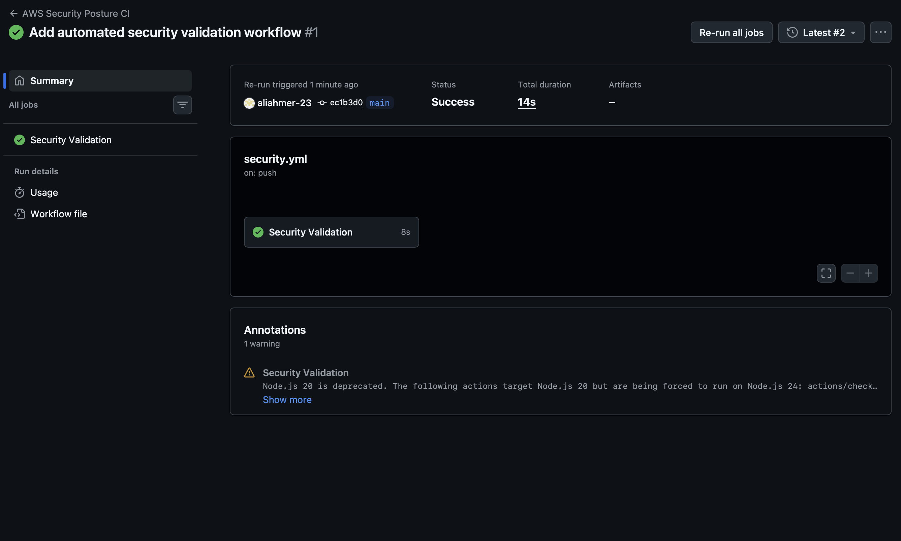

# AWS Security Posture Scanner

A Python-based AWS cloud security posture assessment tool for identifying security misconfigurations across core AWS services using read-only AWS API access.

## Overview

AWS Security Posture Scanner combines live AWS asset collection, normalized security analysis, risk scoring, assessment coverage tracking, compliance metadata, evidence-based findings, remediation guidance, and automated reporting.

The project is designed as a practical cloud-security engineering tool rather than a simple configuration checker.

## Supported AWS Services

The scanner currently assesses eight security areas:

- IAM
- Amazon S3
- Amazon EC2 Security Groups
- AWS CloudTrail
- Amazon RDS
- AWS KMS
- Amazon VPC
- AWS Lambda

## Key Features

- Live read-only AWS assessment
- Offline fixture-based assessment
- Structured security findings
- Severity-based risk scoring
- Evidence attached to findings
- Assessment coverage tracking
- Collection-error handling
- AWS Security Hub CSPM mappings
- Actionable remediation guidance
- JSON reporting
- HTML reporting
- SARIF 2.1.0 reporting
- Automated unit and integration testing
- GitHub Actions CI validation

## Architecture

The scanner separates AWS data collection from security analysis.

    AWS APIs / Fixtures
            |
            v
        Collectors
            |
            v
       Normalization
            |
            v
     Assessment Engine
        /         \
       v           v
    Findings     Coverage
       \           /
        \         /
         v       v
        Risk Engine
            |
            v
     JSON / HTML / SARIF

This architecture helps ensure that AWS API or permission failures are not incorrectly interpreted as secure configurations.

## Live AWS Assessment

Run a live read-only assessment:

    python3 aws_posture.py --live

Specify a region:

    python3 aws_posture.py --live --region us-east-1

Use an AWS CLI profile:

    python3 aws_posture.py --live --profile security-audit --region us-east-1

Authentication uses the standard AWS SDK credential provider mechanisms.

The scanner does not store AWS credentials in the project.

## Offline Assessment

A normalized local fixture can be assessed without connecting to AWS.

Secure fixture:

    python3 aws_posture.py --fixture fixtures/secure.json

Insecure fixture:

    python3 aws_posture.py --fixture fixtures/insecure.json

Fixtures make the assessment engine reproducible and testable without requiring live cloud infrastructure.

## Assessment Coverage

Security risk and assessment visibility are tracked independently.

The scanner currently reports coverage for:

- IAM
- S3
- EC2
- CloudTrail
- RDS
- KMS
- VPC
- Lambda

Coverage states include:

- COMPLETE
- PARTIAL
- FAILED

Collection errors are preserved rather than interpreted as evidence that an AWS resource is secure.

Example:

    ASSESSMENT COVERAGE
    ------------------------------------------------------------
    IAM:            COMPLETE
    S3:             COMPLETE
    EC2:            COMPLETE
    CloudTrail:     COMPLETE
    RDS:            COMPLETE
    KMS:            COMPLETE
    VPC:            COMPLETE
    Lambda:         COMPLETE

    Collection errors:     0
    Assessment confidence: COMPLETE

## Security Findings

Findings use a structured model containing information such as:

- Finding ID
- Severity
- AWS service
- Resource identifier
- Title
- Observation
- Evidence
- Recommendation
- Compliance metadata

This allows findings to be consumed by both humans and automation.

## Risk Engine

Security findings are evaluated using severity-based risk scoring.

Supported severity levels include:

- Critical
- High
- Medium
- Low
- Informational

Assessments produce a numerical risk score and an overall risk classification.

## AWS Security Hub Compliance Mapping

Selected findings contain mappings to AWS Security Hub CSPM controls.

The mapping registry supports relationship types including:

- DIRECT
- PARTIAL
- RELATED

Mappings currently cover selected findings across IAM, S3, CloudTrail, RDS, KMS, and Lambda.

Compliance metadata is serialized with findings and included in supported reports.

These mappings describe relationships between scanner findings and AWS Security Hub controls. They do not represent formal compliance certification.

## Remediation Guidance

Findings include actionable remediation recommendations.

Detection and remediation guidance are intentionally separated: the scanner reports security problems but does not automatically modify AWS infrastructure.

## Reporting

Assessments generate three report formats.

### JSON

Machine-readable structured security results:

    reports/aws_posture.json

### HTML

Human-readable security assessment containing risk, coverage, findings, evidence, compliance metadata, and remediation guidance:

    reports/aws_posture.html

### SARIF

SARIF 2.1.0 output for integration with security and CI/CD tooling:

    reports/aws_posture.sarif

Generated reports are excluded from Git version control.

## Automated Testing

The project contains an extensive automated test suite covering:

- Assessment orchestration
- Risk calculations
- Finding serialization
- IAM security checks
- S3 security checks
- EC2 security checks
- CloudTrail security checks
- RDS security checks
- KMS security checks
- VPC security checks
- Lambda security checks
- AWS collectors
- AWS API pagination
- Collection error handling
- Data normalization
- Coverage calculations
- Compliance mappings
- JSON reporting
- HTML reporting
- SARIF reporting
- CLI behavior
- Live-assessment orchestration

Run all tests:

    python3 -m unittest discover -s tests

## Continuous Integration

GitHub Actions automatically validates the project on pushes and pull requests to the main branch.

The security-validation pipeline performs:

1. Dependency installation
2. Python source compilation
3. Automated test execution
4. Secure fixture validation
5. Insecure fixture detection
6. Exit-code validation

### GitHub Actions - Security Validation Passed

## Installation

Clone the repository:

    git clone <repository-url>
    cd aws-security-posture

Install dependencies:

    python3 -m pip install -r requirements.txt

Current runtime dependency:

    boto3>=1.34,<2.0

## CLI

Display available commands:

    python3 aws_posture.py --help

Available options:

    --fixture FIXTURE
    --live
    --region REGION
    --profile PROFILE
    --version

## Project Structure

    aws_posture.py
        CLI entry point

    awssec/
        assessment.py
        compliance.py
        coverage.py
        engine.py
        models.py

    collectors/
        aws.py
        cloudtrail_details.py
        iam_details.py
        live.py
        normalize.py
        s3_details.py
        session.py

    checks/
        iam.py
        s3.py
        ec2.py
        cloudtrail.py
        rds.py
        kms.py
        vpc.py
        lambda_security.py

    reporting/
        reports.py
        sarif.py

    fixtures/
        secure.json
        insecure.json

    tests/
        automated test suite

    .github/workflows/
        security.yml

## Security Design Principles

The project follows several cloud-security engineering principles:

- Read-only assessment
- Least-privilege AWS access
- Separation of collection and detection
- Explicit handling of incomplete visibility
- Structured findings
- Evidence-backed detection
- Actionable remediation guidance
- Automated regression testing
- CI/CD security validation
- Machine-readable reporting

## Safety

AWS Security Posture Scanner is designed for assessment only.

It does not:

- Create AWS resources
- Delete AWS resources
- Modify AWS configurations
- Automatically remediate findings
- Store AWS credentials

For live assessments, use an appropriately scoped read-only or security-audit identity following least-privilege principles.

## Version

AWS Security Posture Scanner 1.0.0

## Disclaimer

Use this scanner only with AWS accounts and environments you are authorized to assess.

Security findings and compliance mappings should be independently reviewed before being used for production risk or compliance decisions.
